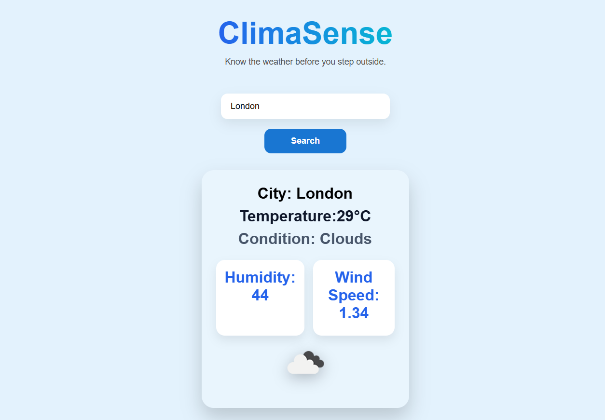

# 🌦️ ClimaSense

ClimaSense is a modern weather application built with **React** and the **OpenWeatherMap API**. It allows users to search for any city and instantly view real-time weather information with a clean, responsive interface and dynamic weather-based backgrounds.

---

## 🚀 Features

- 🔍 Search weather by city name
- 🌡️ Real-time temperature
- 💧 Humidity information
- 🌬️ Wind speed
- ☁️ Weather condition with icons
- 🎨 Dynamic UI background based on weather conditions
- 📱 Responsive and modern interface
- ⚡ Fast API requests using Axios

---

## 🛠️ Tech Stack

- React
- Vite
- JavaScript (ES6+)
- CSS3
- Axios
- OpenWeatherMap API

---

## 📂 Project Structure

```
ClimaSense/
│── public/
│── src/
│   ├── App.jsx
│   ├── App.css
│   ├── main.jsx
│── .env
│── package.json
│── vite.config.js
```

---

## ⚙️ Installation

Clone the repository

```bash
git clone https://github.com/YOUR_USERNAME/ClimaSense.git
```

Move into the project directory

```bash
cd ClimaSense
```

Install dependencies

```bash
npm install
```

Create a `.env` file in the project root and add your OpenWeatherMap API key

```env
VITE_API_KEY=YOUR_API_KEY
```

Start the development server

```bash
npm run dev
```

---

## 📸 Preview



---

## 🌍 API Used

- OpenWeatherMap Current Weather API

https://openweathermap.org/current

---

## 🔮 Future Improvements

- 📅 5-Day Weather Forecast
- 📍 Current Location Weather
- 🌅 Sunrise & Sunset Information
- 🌫️ Air Quality Index
- ⭐ Favorite Cities
- 🌙 Dark Mode
- 📊 More Detailed Weather Statistics

---

